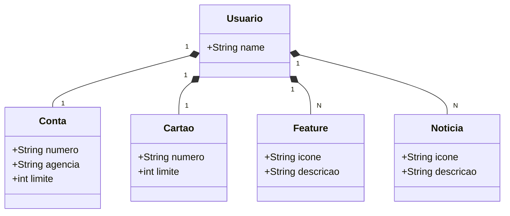

# Projeto para realizar deploy na nuvem de uma API Restful

## Diagrama de classes

```mermaid
classDiagram
    class Usuario {
        +String name
    }

    class Conta {
        +String numero
        +String agencia
        +int limite
    }

    class Cartao {
        +String numero
        +int limite
    }

    class Feature {
        +String icone
        +String descricao
    }

    class Noticia {
        +String icone
        +String descricao
    }

    Usuario "1" *-- "1" Conta 
    Usuario "1" *-- "1" Cartao 
    Usuario "1" *-- "N" Feature
    Usuario "1" *-- "N" Noticia
```
